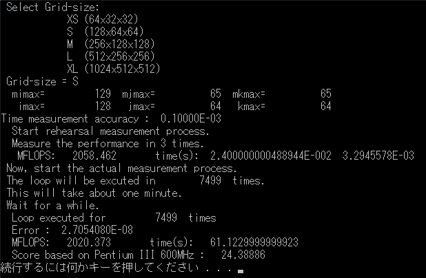

# Himeno Benchmark in Modern Fortran

This program is a Himeno benchmark problem written in Modern Fortran style.

## Descriptions

This program is a Himeno benchmark problem written in Modern Fortran style, achieving almost the same execution performance as the original version.
In this program, global variables are eliminated, and some variable names and subroutine names are refactored.

## Demo

## Requirement
Fortran 2008 or later.
This program is compiled and tested using Intel oneAPI ver. 2021.1 for windows, gfortran ver. 9.3.0 for ubuntu on wsl2, and gfortran ver. 9.2.0 for macos.

## Usage

1. compile the source code
1. execute the created .exe file
1. input Grid-size from a keyboard
1. The program will run for roughly 60 seconds
1. Benchmark results will be displayed after execution is successfully done

## Installation
git clone or simply download .f90 file

## Compiler Options

|compiler|option|
|:--|:--|
|Intel oneAPI for windows|`/O3 /Qopenmp /Qparallel`|
|gfortran|`-O3 -fopenmp -floop-parallelize-all -ftree-parallelize-loops=<N>`|

For Intel oneAPI, The environment variable `OMP_NUM_THREADS` is used to controll the number of threads for parallel processing.

## Licence
LGPL 2 or later